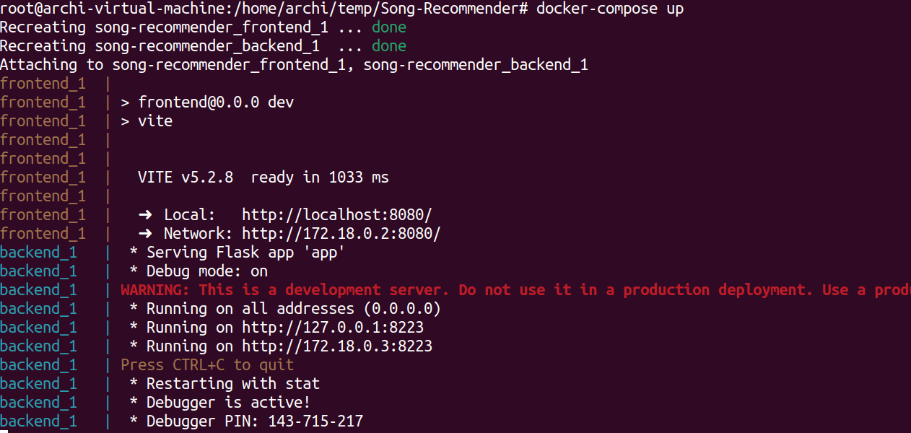

To install the application, follow the given steps:-

**Step-1 :** First Clone the GitHub repository using the command - 
```git clone https://github.com/ArijitGuha0179/Song-Recommender.git```


**Step-2 :** Move into the project directory using -
```cd Song-Recommendor```

**Step-3 :** Build the docker image and install the application by running the command-
```docker-compose build```


Building the docker image might take time.

**NOTE:** If you have previously built the docker image then you can skip this step.

**Step-4:** Run the docker and the web application by using the command-
```docker-compose up```



Once all these commands run successfully the application will start running on
http://localhost:8080
