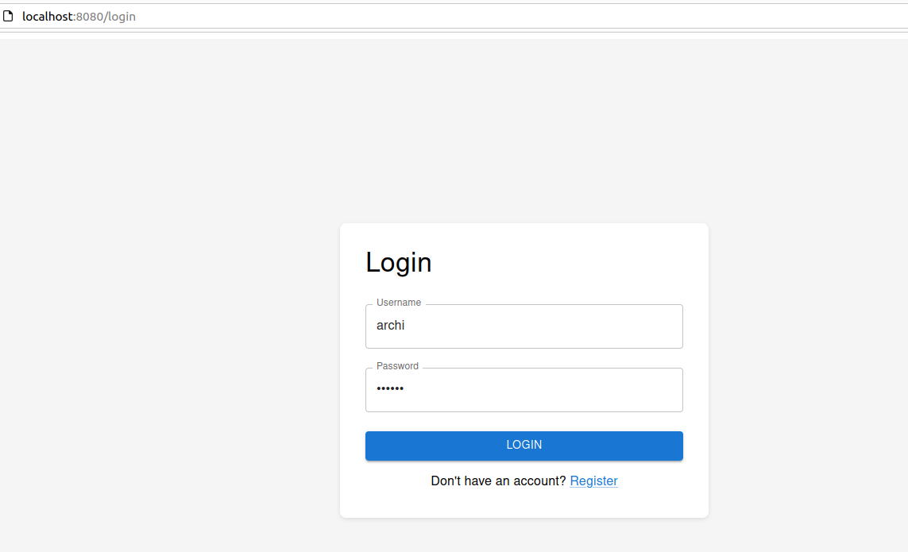
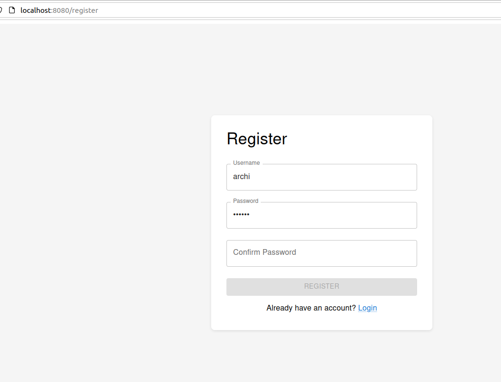
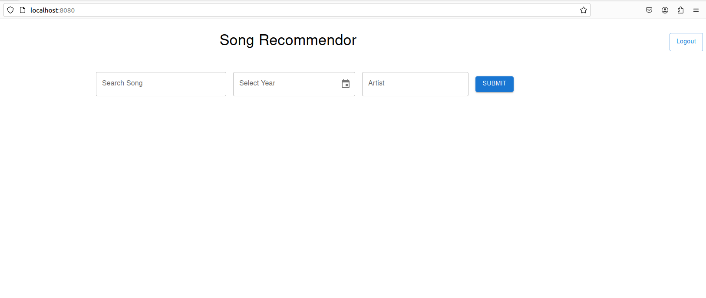
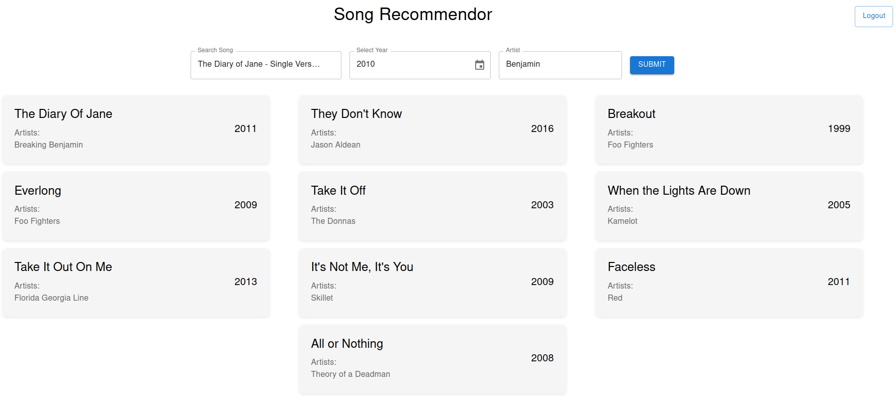

Once the application is installed.Your can run the application by following the steps given below.

NOTE: Before running make sure you are connected to the internet.Also, to run the app you need to add your ```CLIENT_ID``` and ```CLIENT_SECRET``` in the file ```model.py``` to get connected to spotify API.To know more you can follow this [link](https://cran.r-project.org/web/packages/spotidy/vignettes/Connecting-with-the-Spotify-API.html#:~:text=Log%20in%20with%20your%20Spotify,unhide%20your%20'Client%20secret'.). 

**Step-1:** Click on http://localhost:8080/ to open the application on a browser.



You will be directed to login page first.

**Step-2:** First,you need to register if you haven't registered before.However, you can skip this step if you have completed registration before.



**Step-3:** Once step-2 is completed,you can login using your user credentials.Once you complete the login you will be directed to the home page.



**Step-4:** To use the song recommendation system, you need the put the name of the song, the year around which it was released and the name of the artist(It's not mandatory to put the name of the artist).Once you put all these,click on ```Submit``` button to get the top most recommended songs. 



**Step-5:** Once, you have completed using the application you can use the logout button to log out.
